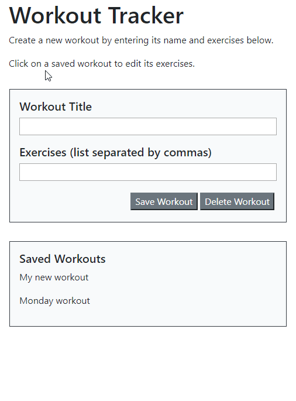

# Workout Tracker

## Getting Started
Open a Git Terminal and start the server:

    node server.js

Then open your browser and open localhost:3000

### Prerequisites
  * Git terminal
  * MongoDB
  * Express
  * Morgan

### Installing
    1. Go to https://github.com/ruthtech/workout-tracker and click on the "Clone or Download" button. 
    2. Choose "Download ZIP". 
    3. Unzip into a directory. If you're on Windows, open File Explorer and navigate to the download directory. Select the ZIP file, right click, and choose "Extract All". Accept the default location.
    4. Once the file is unzipped, navigate to workout-tracker-master.
    5. If you don't have the prerequisites installed, type the following:
       * npm install mongodb
       * npm install express
       * npm install morgan
    6. Then use your Git terminal to execute server.js. 

## Running the tests
No automated test suite has been created for these files.

### Manual tests
1. Add a new workout
2. Select a workout from the Saved workouts, edit it, save. Is it updated?
3. Select a workout from the Saved workouts, delete it. Is it gone?

## Deployment
To deploy this on a live system, follow the instructions in "Installing". Alternatively, to see this in action, watch the following animated GIF:

## Built With
* [Visual Studio Code] https://code.visualstudio.com/docs/setup/setup-overview
* [Visual Studio Code Extension "Open in Browser"] 
    * Open VS Code.
    * Open the extensions pane and search for open in browser.
    * Select the version written by TechER and click Install.
* Git Terminal (https://git-scm.com/downloads)
* Node (https://nodejs.org/en/download/)
     * express
     * mongodb
     * morgan

## Contributing
This project is not open to contributions.

## Versioning
This project does not use versions at this time. 

## Authors
Ruth Lee

## License
MIT

## Acknowledgments
Thanks to the following:
* U of T Coding Bootcamp (https://bootcamp.learn.utoronto.ca/coding/)

       

